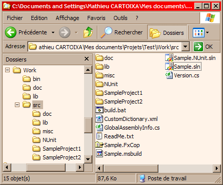

As a new year resolution, I have [freely](http://www.nytimes.com/2007/01/02/science/02free.html?ex=157680000&amp;en=cd3dc) decided to commit myself into blogging about software development. So let me start slowly and write about source code organization.

The usual way to organize source code for a new project is to create a directory and have your IDE create your solution and your project in it (VS2005 vocabulary, mutatis mutandis for other IDEs/languages). Hopefully, you will stick with it, but more realistically you will have to add new projects for your libraries, executables, installers. You will also have to share resources, files and other scripts between projects. You will start to hack your own project again and again in order to add new resources until it becomes a total mess. You are starting to "lose" (and then duplicate) files (especially resources, like images). Unused files are forgotten and left, only adding to the confusion. This pattern is described for a single developer, but it is even easier and faster to get there with many developers.

Another way would be to have rules (remind me to blog about rules in general) to keep your files consistently organized. Here is my template organization, which is obviously only worth what it is:

Here the folder hierarchy description:
* `Work`: the root folder. It may contain general files like `ReadMe.txt`...
  * `bin`: the actual released software (libraries and/or executables and/or installers).
  * `doc`: the user documentation folder. Contains all the documentation on how to use the pieces of software located in bin.
  * `lib`: the external dependencies (e.g. libraries) needed for the project.
  * `src`: the source code folder. At this level, one can find all the project solutions and other build scripts.
    * `doc`: the developer documentation folder. Contains diagrams, DSLs, generated documentation...
    * `lib`: the internal dependencies. For instance, I would put the NUnit libraries there.
    * `misc`: the files that could possibly not find a home elsewhere. I would have a Sample.snk file (holds a signature key) there.
    * `NUnit`: unit tests projects.
    * `SampleProject1`: a sub-project would fit in there.
    * `SampleProject2`: another sub-project would fit in there.

This pattern can be refined as necessary (e.g. doxygen scripts are in `src\doc\doxygen`, build tools in `src\misc\Tools`...). This hierarchy also helps enforce the way the software is released. More on that later...
