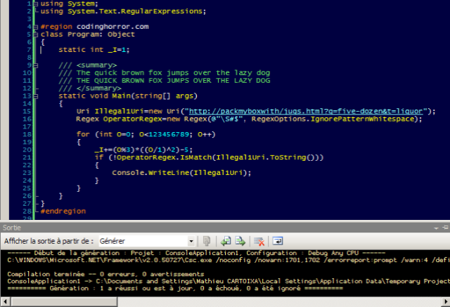

I know I am a bit late to join [this debate](http://www.codinghorror.com/blog/archives/000682.html), but:
* I was new at my job at the time. After a few years spent in a few french companies, I was obviously not quite used to the internet as it had become since I left college, and I must admit I was as close as could be to miss the web 2.0 buzz. This blog was a longshot then.
* July has only 3 full days left, and I realize it looks like my last oppurtunity to post something this month...
* After I had this casual conversation with our new intern where I stated half jokingly that there was nothing wrong for a developer to keep the default [Fisher-Price-like](http://www.pcworld.com/resource/article/0,aid,117427,00.asp) [Windows XP theme](http://en.wikipedia.org/wiki/Luna_(theme)) (except that it looked rather unprofessional ;-), he set himself to tweak the colors, not only of his system, but also of his Visual Studio syntax coloring! This reminded me of Jeff Atwood's old post.

So here it is:

Having been raised with a DOS [Turbo Pascal](http://en.wikipedia.org/wiki/Turbo_Pascal) environment, I got used to the theme. When I switched to Microsoft tools, I tried to create something close, but with a darker background, which I find more resting. You can download the settings [here](/assets/files/2007/2007-07-27-VSMac.vssettings.zip). I have also posted it on [Ning](http://idehotornot.ning.com/index.php/index/show?id=6129010) (where you might want to rate it).
