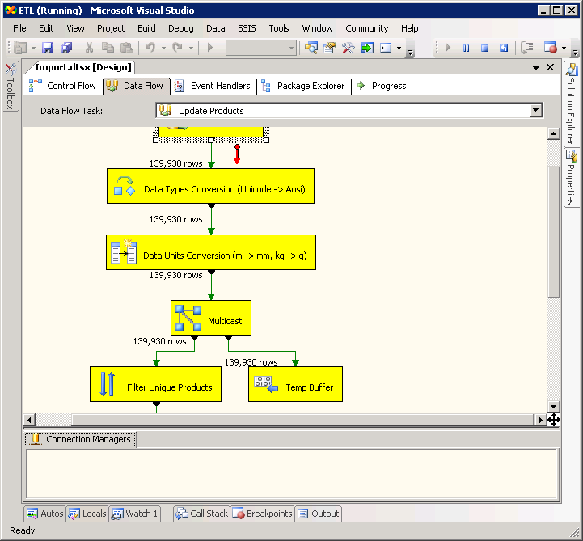

I have had the opportunity to discover [Sql Server 2005 Integration Services](http://www.microsoft.com/sql/technologies/integration/default.mspx) (SSIS) lately. That was a double blow. At first, I found it highly usable, though rough on the edges: still only a very promising tool. And then I found it was the perfect example of a software factory created with the [Visual Studio Domain-Specific Language Tools](http://msdn2.microsoft.com/en-us/vs2005/aa718368.aspx). It is great to see Microsoft eating its own dog food, and create a great tool with it.

I kept ~~playing~~ working with it for a while and then I slightly became more and more frustrated by this experience. For instance, the process of modifying a data flow is tedious and laborious if a data source structure has been changed. And as happened with the Windows Forms designer, I soon felt the urge to bypass the designer to quickly mess with the code. My deep feeling is that designers are great to get started, editors are great to get finished. But in the case of SSIS, there is no such thing as code. All you can have is a XML file containing your flow design, messed up with presentation concerns, useless metadata, magical numbers... Great for machines, useless for humans.

The problem here, is that you have no [Domain-Specific Language](http://martinfowler.com/bliki/DomainSpecificLanguage.html) (DSL) per se. Or, better, that the DSL has been generated by a machine. Some people have identified this flaw and [felt the need for proper code](http://www.ayende.com/Blog/archive/2007/07/19/Idea-The-Boo-ETL-DSL.aspx), even for ETLs. I have even found a [code only](https://web.archive.org/web/20080325233534/http://activewarehouse.rubyforge.org/etl/) ETL being developed. This, in my opinion, is the right thing to do, and I shall remember it when I design my own Software Factories: a DSL is mandatory, the designer is here for comfort.

SSIS is a great tool. It just lacks a DSL.
