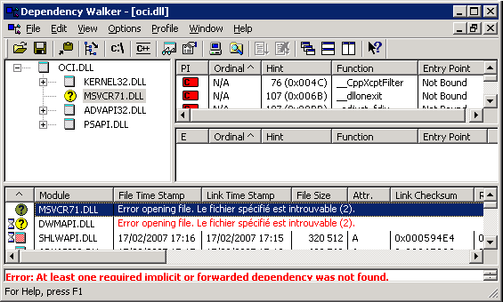

I got stuck with this error message yesterday:
> System.Data.OracleClient requires Oracle client software version 8.1.7 or greater

Mmmh. Let me give you some context. I have been working for almost a year now on this ASP .NET application:
* connected to an Oracle 10g database.
* uses the Microsoft ADO .NET provider for Oracle (preferred over [ODP .NET](http://www.oracle.com/technology/tech/windows/odpnet/index.html) 10g for its Visual Studio 2005 integration and its ability to work above Oracle [Instant Client](http://www.oracle.com/technology/tech/oci/instantclient/index.html)).
* bundled Oracle Instant Client 10.2 (more on that later...).
* uses impersonation.
* tested on numerous development environments and a couple of servers without a glitch.

This error occurred on a new and freshly installed Windows Server 2003 server. Without a clue, I looked for help on the Internet, basing my search on the error message. An I found [a good one](https://docs.microsoft.com/en-us/archive/blogs/fabdulwahab/system-data-oracleclient-requires-oracle-client-software-version-8-1-7-or-greater), or so I thought. Let me get this straight: if you get the error above, it is very likely that you have to tweak your security rights on your Oracle client installation as suggested on the previous link. But not in my case, because of the way I had bundled Oracle Instant Client in my application :
* the DLLs are deployed in the application `bin` directory.
* the application `bin` directory is added in front of the %PATH% environment variable at application startup. This is how it is done :

In the Global.asax file:
```csharp
protected void Application_Start(object sender, EventArgs e)
{
    // Code that runs on application startup
    SetEnvironmentVariable(
        "PATH",
        string.Format(
            CultureInfo.InvariantCulture,
            "{0};{1}",
            Path.Combine(HttpContext.Current.Request.PhysicalApplicationPath, "bin"),
            Environment.GetEnvironmentVariable("PATH")
        )
    );
}

[DllImport("kernel32.dll", EntryPoint="SetEnvironmentVariableW", CharSet=CharSet.Unicode)]
public static extern bool SetEnvironmentVariable(string name, string val);
```
So in my case, the Oracle client installation was my application `bin` directory, which had the proper rights. This did not prevent me from trying to give everyone full access, just to make sure. But, very predictively, it failed to solve my problem.

I began to sweat a little. Did I really need to install a full Oracle client on the server? No: I proved otherwise. I thought...

At last resort, I decided to use the indispensable [Reflector for .NET](http://www.aisto.com/roeder/dotnet/) to check the piece of code responsible for throwing the exception. Nothing very fancy there, but I noticed after a while a peculiar trace mechanism. I tried to analyze it to find a way to enable it. And after a long while, I found out that Microsoft ADO .NET providers could be plugged into the [Event Tracing for Windows](http://msdn.microsoft.com/en-us/library/aa964124.aspx) for debugging. Not very straightforward, but I managed to get it work. And here is the interesting piece of trace I got:
> `<oc|ERR|THROW> 'System.DllNotFoundException: Impossible de charger la DLL 'oci.dll': Le module spécifié est introuvable. (Exception de HRESULT : 0x8007007E) ,   à System.Data.Common.UnsafeNativeMethods.OCILobCopy2(IntPtr svchp  IntPtr errhp  IntPtr dst_locp  IntPtr src_locp  UInt64 amount  UInt64 dst_offset  UInt64 src_offset) ,   à System.Data.OracleClient.OCI.DetermineClientVersion()'`

Please pardon my french ;-) "Come on", I said to myself, "how can you not find this DLL when it is clearly in your %PATH%?" Or is it not? To be sure, I checked with [Process Explorer](http://technet.microsoft.com/en-us/sysinternals/bb896653.aspx). Indeed, it is.

The truth is out there: what if it could find the said DLL, but could not load it for any reason? Indeed, a search focusing more on DllImport than on Oracle [confirmed this](http://forums.asp.net/t/1267713.aspx): a missing dependency could trigger this exception. So I decided to check dependencies with the [Dependency Walker](http://www.dependencywalker.com/).


So the Oracle Instant Client relies on `MSVCR71.DLL`, which is just not there. Isn't that DLL supposed to be by default in the `C:\WINDOWS\system32 directory`? Well, it used to, but [not any more](http://support.microsoft.com/kb/326922).

This is it. This dependency is so common that it had been somehow installed on all previous environments but not this one. I just added it to the application installation packages, alongside `OCI.DLL`, and that was it.

Note : Oracle Instant Client 11.1 is delivered with all its dependencies, including `MSVCR71.DLL`...
