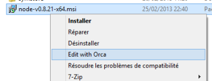
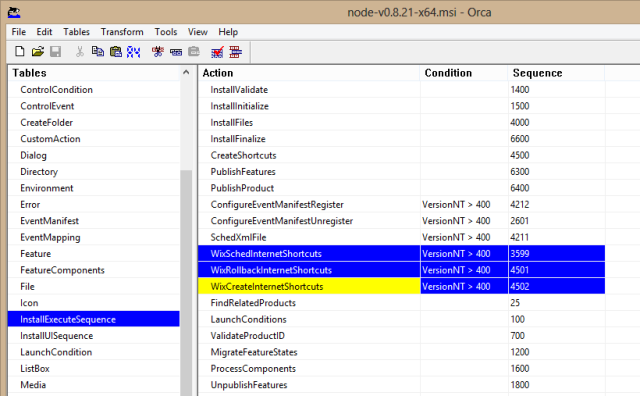

[node.js](http://nodejs.org/) is [supported by default on a Windows Azure WebSite](http://www.windowsazure.com/en-us/develop/nodejs/tutorials/create-a-website-(mac)/). But there are cases when you might need to deploy an application on an heavier (and more expensive) Cloud Service. Such a case is when you need SSL on a custom domain, as Azure WebSites [do not yet support custom certificates](http://social.msdn.microsoft.com/Forums/en-US/windowsazurewebsitespreview/thread/0218204f-7be3-4586-bfdb-831cde6b7937).

Cloud Services instances can be customized through [startup tasks](http://msdn.microsoft.com/en-us/library/windowsazure/hh180155.aspx). This is how you would install and configure _node.js_ (and [iisnode](https://github.com/tjanczuk/iisnode), presumably): create a startup task that installs _node.js_, _iisnode_, and runs `npm install` on your package. It all seems pretty straightforward (though it may be the subject of a future post).

Except that _node.js_ **cannot** be installed on a Cloud Service as is ([yet](https://github.com/joyent/node/commit/8164b2f)): if you try to execute [the installer](http://nodejs.org/download/) on a Cloud Service instance, it will fail at the _Creating shortcuts_ stage (as you’ll see in the installer logs). The default node.js installer tries to create shortcuts in the Windows start menu, which is (quite understandably) a disabled functionality  in this version of Windows. And there is no way to tell the installer not to execute this step. So we’re doomed…

Well, there is a way to get around this. We can edit the official installer with [Orca](http://msdn.microsoft.com/en-us/library/windows/desktop/aa370557.aspx), the database table editor for Windows installer packages. It needs to be installed first (the installer can be found along the [Microsoft Windows SDK for Windows 7 and .NET Framework 4](http://www.microsoft.com/en-us/download/details.aspx?id=8442) binaries, in `%ProgramFiles%\Microsoft SDKs\Windows\v7.1\Bin`). Once done, you can right-click the node.js installer and select the _Edit with Orca_ menu.

As you can see, an installer package is nothing more than a database of all the components and actions performed during the install. Just select the _InstallExecuteSequence_ table, and remove the 3 rows named _WixSchedInternetShortcuts_, _WixRollbackInternetShortcuts_ and _WixCreateInternetShortcuts_.

Just save your changes, and there you go: this package will install properly on a Windows Azure Cloud Service. Maybe one day will there be [a command line option](https://github.com/joyent/node/pull/4694) to save us all this trouble…
