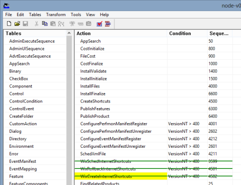

Last time I showed you [how to modify a node.js Windows installer](/blog/software-craftsmanship/2013/03/05/install-nodejs-on-windows-azure-cloud.html) so that you could install it on an Azure Cloud Service as part of a startup task.

As it happens, I just found out another way to perform this task without modifying the installer itself: just create a Windows installer transform file. The process is quite similar, and only [Orca](http://msdn.microsoft.com/en-us/library/windows/desktop/aa370557.aspx) is needed:
* Open the installer in Orca.
* Click the _Transform_ > _New Transform_ menu.
* Do your modifications.
* Click the _Transform_ > _Generate Transform…_ menu to create the transform file.

As you will see, all your modifications are recorded, and appear in green in Orca:

To use this transform file, use the [TRANSFORMS property](http://msdn.microsoft.com/en-us/library/windows/desktop/aa372085.aspx). For instance: `msiexec.exe /qn /i node-v0.10.3-x64.msi TRANSFORMS="node-v0.10.3-x64-azure.mst"`.
