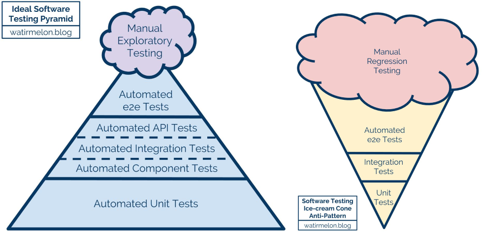

The essentials of Continuous Integration (CI) have [been summarized by Martin Fowler](https://martinfowler.com/articles/continuousIntegration.html). Following is my take on a few principles, practices and/or considerations that have served me well over the years.

* [Integrate continuously](#integrate-continuously)
* [Build in 1 step](#build-in-1-step)
* [Ensure quality](#ensure-quality)
* [Build fast](#build-fast)
* [Create deployable packages](#create-deployable-packages)

## Integrate continuously
It looks quite silly writing this, but Continuous Integration is about... *continuously* integrating software! [Trunk Based Development](https://trunkbaseddevelopment.com/) is thus a very natural fit.

Of course I have been told that *this is not the way you do things*, meaning [GitFlow](https://nvie.com/posts/a-successful-git-branching-model/) is the only true way. Let the creator of this model answer to that:
<blockquote class="twitter-tweet" data-theme="light">
Just updated my git-flow blog post after some orange site fuss yesterday with a bit of nuance that hopefully lets everyone interested make their own decisions for adoption.<a href="https://t.co/pbsp8kK10R">https://t.co/pbsp8kK10R</a> <a href="https://t.co/FeahNeOkm5">pic.twitter.com/FeahNeOkm5</a>
&mdash; Vincent Driessen (@nvie) <a href="https://twitter.com/nvie/status/1235525767297003526?ref_src=twsrc%5Etfw">March 5, 2020</a></blockquote>

## Build in 1 step
This one is literally [step 2 of the Joel Test](https://www.joelonsoftware.com/2000/08/09/the-joel-test-12-steps-to-better-code/) (written in 2000 by the way: how much do you score today?).

I will just add that to me every developer should be able to perform this step **locally**:
* it is another way to write: don't let YAML become the language of choice for your build. Don't get me wrong, YAML has a fine syntax for configuring systems (and [it has comments](https://justin.kelly.org.au/comments-in-json/)!). But it cannot properly describe your build for several reasons:
  * it is tied to the CI tool you are using. [AppVeyor syntax](https://www.appveyor.com/docs/appveyor-yml/) is different from [Travis CI](https://docs.travis-ci.com/user/build-config-yaml) which is different from other vendors. Why lock yourself in?
  * a complex configuration is hard to describe (and harder to understand) in YAML. There are so many expressive languages and tools nowadays to describe a build that are intimately tied to your platform of choice that it is almost ridiculous: [Ant](https://ant.apache.org/) (the precursor), [MSBuild](https://docs.microsoft.com/en-us/visualstudio/msbuild/msbuild), [Gulp](https://gulpjs.com/), [Grunt](https://gruntjs.com/), [Maven](https://maven.apache.org/), [Gradle](https://gradle.org/), [Phing](https://www.phing.info/), [Rake](https://ruby.github.io/rake/), [Cake](https://cakebuild.net/), [Psake](https://psake.readthedocs.io/en/latest/)... Or at least please revert to [the good old Makefile](https://www.gnu.org/software/make/manual/make.html)!
  * if the software you are building must be built cross platform, do yourself a favor and pick up a tool that natively supports that (and most have been since Ant).
* executing your build locally means you can actually test it before you send your changes to the CI platform. This is especially valuable when you want to change the behavior of your build without having the whole team take a day off while you debug the build directly on the CI platform.
* developers have access to the code of the build and they can act on it. [Surely](https://www.youtube.com/watch?v=KM2K7sV-K74) this must be the first step of what they meant by *DevOps*...
* in the very highly improbable case where you have to urgently build a new version of your software while your CI tool is down, well now you can. I have already been saved by this feature.

## Ensure quality
Your build should ensure a certain level of quality of your source code (ie [internal quality](https://martinfowler.com/articles/is-quality-worth-cost.html)). There are multiple ways to do that and one should use as many as possible:
* **compilation** (for languages for which it is relevant, of course).
  * For your own sake crank up the [warning](https://gcc.gnu.org/onlinedocs/gcc/Warning-Options.html) [level](https://docs.microsoft.com/en-us/cpp/build/reference/compiler-option-warning-level) to 11 if possible and treat warnings as errors. You will thank yourself later.
* **static analysis** is indispensable for interpreted language (like [ESLint](https://eslint.org/) for JavaScript or [Rubocop](https://docs.rubocop.org/rubocop/index.html) for Ruby) but can also be invaluable for compiled languages. I used to love [Cppcheck](http://cppcheck.sourceforge.net/) back in the day and I have had a pretty good experience integrating [SonarSource](https://www.sonarsource.com/) on my C# codebase.
  * The same goes as for compilation warnings: activate as many checks as possible, as early as possible, and treat them as errors. Nobody wants to correct 100s of warnings on a large codebase (and nobody does), and if you let too many warnings creep in you will not notice the occasional important new message in the middle of all the unimportant stuff.
* **automated tests**, because that is exactly what they are here for. More on them later.
  * While you are at it, code coverage is a very relevant indicator of quality: though 100% code coverage does not necessarily mean much, 0% tells a lot about the quality of your codebase!

Be as strict as possible about what indicator changes should result in a failed build. If you are not, metrics will slip away (like code coverage for instance) and become useless.

## Build fast
Continuous means that a new build should be performed every time a developer pushes her changes to the repository. If there is a problem with those changes:
* she wants to know as fast as possible while the changes are fresh in her mind.
* her teammates want to know if they can safely synchronize with the remote. Failing to do so could result in the whole team being unable to work (because of a failing test for instance).

In most cases this means that the build should distinguish between fast checks that can be performed every time and slow checks that could be performed asynchronously (think Nightly Builds). This usually means [distinguishing Unit Tests from Integration Tests](https://martinfowler.com/articles/practical-test-pyramid.html). Continuous Integration is thus very beneficial to the proud owners of [a tests pyramid](https://watirmelon.blog/melon-of-knowledge/testing-pyramids/) (as opposed to the owners of a tests ice-cream cone):

## Create deployable packages
If all of the above is in place, everything left to do is create *deployable packages*. What do I mean by that?

A deployable package is a complete and configurable archive containing all the necessary files for the project to run.
* Complete means it contains:
  * compiled (and/or minified) sources.
  * assets.
  * dependencies.
    * I guess I am not a strong believer in the manual merging of [lock](https://rubyinrails.com/2013/12/10/what-is-gemfile-lock/) [files](https://docs.npmjs.com/files/package-locks)...
    * This way you can avoid having to fetch dependencies after every deployment:
      * It may be problematic on the rare occasions when your dependency repository goes down...
      * Depending on the way dependencies have been declared you may not be sure that what you are deploying is what you tested.
* Configurable means you can dynamically specify platform specific configurations at the time of installation (like a connection string to a database for instance):
  * [Web Deploy](https://www.iis.net/downloads/microsoft/web-deploy) is the quintessence of a technology that allows that for web applications. I wish Microsoft would invest in making it more ubiquitous (targeting nginx for instance) and... easy to use...
  * When possible (which is most of the times) my configuration is safely stored in one or several local files instead of [potentially leaking environment variables](https://towardsdatascience.com/leaking-secrets-in-web-applications-46357831b8ed).

Being complete and configurable, you can test the same package on different stages and really make sure of the quality of what is going to be deployed in Production. You can store those packages in a dedicated repository: [GitHub Releases](https://docs.github.com/en/github/administering-a-repository/releasing-projects-on-github) for instance. I say we are not far from Continuous Delivery (CD) there.

This also means that you do not have to install and configure Git on your Production servers.

