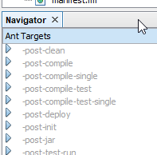

From what I understand [Gradle](https://gradle.org/) or even [Maven](https://maven.apache.org/) are the way to go for your build in Java. They seem to rely heavily on conventions, which is good. But if you need (or want) to add to these conventions (like I do with [my practices](/blog/software-craftsmanship/2020/09/02/my-take-on-continuous-integration.html)) it seems that the only 2 ways are to either build your own plugins or to execute additional [Apache Ant](https://ant.apache.org/) tasks and targets inside your build. So it seems to me that the good old [Apache Ant](https://ant.apache.org/) is still alive and well.

## The project
As we will investigate in the next installment of this series I needed to create a build for a Salesforce project using the [Salesforce CLI](https://developer.salesforce.com/tools/sfdxcli). No build tool is truly native to this environment, and Salesforce is very keen on demonstrating how simple builds can be achieved [by batching command lines executions](https://developer.salesforce.com/blogs/2019/05/continuous-integration-with-salesforce-dx.html). I did not feel that this would allow me to create [the kind of build that I wanted](/blog/software-craftsmanship/2020/09/02/my-take-on-continuous-integration.html), and for reasons that I will detail when we get there I settled on using [Apache Ant](https://ant.apache.org/) instead. In order to have proper control over the execution and the outputs I decided to encapsulate the [Salesforce CLI](https://developer.salesforce.com/tools/sfdxcli) commands into proper [Ant](https://ant.apache.org/) tasks (instead of using the [`exec`](https://ant.apache.org/manual/Tasks/exec.html) task). Hence the [ant-sfdx](https://github.com/mcartoixa/ant-sfdx) project ([https://github.com/mcartoixa/ant-sfdx](https://github.com/mcartoixa/ant-sfdx)).

The main elements of the project are:
* [The build file](#the-build-file) (`build.xml`).
* [The script file](#the-script-file) (`build.bat`) that helps executing the build file locally.
* [The CI configuration file](#the-ci-configuration-file) (`.travis.yml`).

### The build file
Given that the goal is to create [Apache Ant](https://ant.apache.org/) tasks, it seems natural that I used it for this project as well, if only to acquire more experience with it. I also settled on using [NetBeans](https://netbeans.org/), not because it is the best Java IDE around (I hope it is not) but because it provides an excellent support for [Apache Ant](https://ant.apache.org/) and it can create a complete and extensible build based on [Apache Ant](https://ant.apache.org/).

As a matter of fact if I just import the build file provided by [NetBeans](https://netbeans.org/) in my own `build.xml` I automatically get all the targets I need to compile and test the project:
```xml
<import file="nbproject/build-impl.xml" />
```
My build provides the following targets (which should feel familiar by now):
* *clean*: automatically provided by [NetBeans](https://netbeans.org/).
  * Extended to clean the `tmp\` directory.
* *compile*: automatically provided by [NetBeans](https://netbeans.org/).
* *test*: automatically provided by [NetBeans](https://netbeans.org/).
  * Extended to include [JaCoCo](https://www.jacoco.org/jacoco/) for code coverage measurement.
* *package*: creates a package for the plugin which consists of the JAR file, [a POM for reference and deployment](https://maven.apache.org/guides/introduction/introduction-to-the-pom.html) and a zip file for copy and paste deployment.
* *build*: shortcut for the combination of *compile*, *test* and *analyze*.
* *rebuild*: shortcut for the combination of *clean* and *build*.
* *release*: shortcut for the combination of *clean*, *build*, and *package*.

The build provided by [NetBeans](https://netbeans.org/) contains empty targets that are meant to be overridden for extension. For instance the *-post-clean* target is the perfect extension point to delete the `tmp\` directory:
```xml
<target name="-post-clean" depends="clean.tmp" />
<target name="clean.tmp">
  <delete dir="./tmp" includeemptydirs="true" quiet="true" failonerror="false" />
</target>
```

To be able to find extensions points you can try and read the whole included file (1700+ lines of XML!), or you can use [NetBeans](https://netbeans.org/) itself to navigate it:


I can also perform code analysis using [PMD](https://pmd.github.io/):
```xml
<target name="analyze.pmd">
  <taskdef name="pmd" classname="net.sourceforge.pmd.ant.PMDTask">
    <classpath>
      <fileset dir=".tmp/pmd-bin-6.21.0/lib">
        <include name="**/*.jar" />
      </fileset>
    </classpath>
  </taskdef>

  <pmd failOnRuleViolation="true" cacheLocation="tmp/obj/pmd.cache">
    <fileset dir="src/main">
      <include name="**/*.java" />
    </fileset>
    <sourceLanguage name="java" version="1.8"/>
    <ruleset>.ruleset.xml</ruleset>
    <formatter type="text" toConsole="true" />
    <formatter type="html" toFile="tmp/pmd-results.html" />
    <formatter type="xml" toFile="tmp/pmd-results.xml" />
  </pmd>
</target>
```

The *package* target has to be created entirely, but once you know what has to be done (cf. above) it is quite straightforward:
```xml
<target name="package" depends="jar,package.pom">
  <copy todir="tmp/out/bin/" preservelastmodified="true">
    <resources>
      <file file="tmp/bin/ant-sfdx.jar" />
      <file file="ivy.xml" />
    </resources>
  </copy>
  <zip destfile="tmp/out/bin/ant-sfdx.zip" compress="true" level="9" filesonly="true">
    <resources>
      <file file="tmp/bin/ant-sfdx.jar" />
      <file file="ivy.xml" />
      <file file="${ivy.runtime.classpath}" />
    </resources>
    <zipfileset dir="docs" prefix="docs" />
  </zip>
</target>

<target name="package.pom">
  <ivy:makepom ivyfile="ivy.xml" pomfile="tmp/out/bin/pom.xml" conf="default,compile">
    <mapping conf="default" scope="default" />
    <mapping conf="test" scope="test" />
    <mapping conf="compile" scope="compile" />
  </ivy:makepom>
</target>
```
As you may see here there are references to [Apache Ivy](https://ant.apache.org/ivy/): it is the dependency manager of choice when using [Apache Ant](https://ant.apache.org/). I found its learning curve to be somewhat steep but well integrated technologies prove powerful in the end. The dependencies for the project are described in an XML file (of course!) [`ivy.xml`](https://github.com/mcartoixa/ant-sfdx/blob/master/ivy.xml), and part of the build consists of retrieving these dependencies, updating the various CLASSPATHs associated with them and also updating the properties file that is the basis of the [NetBeans](https://netbeans.org/) project so that it remains up to date when dependencies change:
```xml
<target name="prepare.dependencies">
  <ivy:retrieve pattern="ivy/lib/[conf]/[artifact].[ext]" log="quiet" />

  <pathconvert property="ivy.compile.classpath" dirsep="/" pathsep=":">
    <path>
      <fileset dir="${basedir}/ivy/lib/compile" includes="**/*.jar" />
    </path>
    <map from="${basedir}${file.separator}" to="" />
  </pathconvert>
  <pathconvert property="ivy.test.classpath" dirsep="/" pathsep=":">
    <path>
      <fileset dir="${basedir}/ivy/lib/test" includes="**/*.jar" />
    </path>
    <map from="${basedir}${file.separator}" to="" />
  </pathconvert>
  <uptodate property="prepare.ivy.nbproject.isuptodate" srcfile="ivy.xml" targetfile="nbproject/project.properties" />
  <propertyfile file="nbproject/project.properties" unless:set="prepare.ivy.nbproject.isuptodate">
    <entry operation="=" key="ivy.compile.classpath" value="${ivy.compile.classpath}" />
    <entry operation="=" key="ivy.test.classpath" value="${ivy.test.classpath}" />
  </propertyfile>
</target>
```

### The script file
At the core of the [`build.bat`](https://github.com/mcartoixa/ant-sfdx/blob/master/build.bat) script file lies simply the execution of [Apache Ant](https://ant.apache.org/):
```
CALL "%ANT_HOME%\bin\ant.bat" -noclasspath -nouserlib -noinput -lib "ivy\lib\test" -Dverbosity=%VERBOSITY% -f %PROJECT% %TARGET%
```

But before getting there we need to initialize the environment for our build:
* retrieving [Apache Ivy](https://ant.apache.org/ivy/) dependencies that are necessary prior to lauching the build (including [Apache Ivy](https://ant.apache.org/ivy/) itself).
* retrieving dependencies that cannot be retrieved with [Apache Ivy](https://ant.apache.org/ivy/) (like [PMD](https://pmd.github.io/), or [Apache Ant](https://ant.apache.org/) for instance).
* setting up the required environment variables (like `%ANT_HOME%`).

#### Apache Ivy dependencies
Everything [Apache Ivy](https://ant.apache.org/ivy/) related is done right before executing [Apache Ant](https://ant.apache.org/):
* first download [Apache Ivy](https://ant.apache.org/ivy/) itself if necessary.
* then execute it to retrieve the dependencies.

```
IF NOT EXIST ivy MKDIR ivy
PUSHD ivy
IF NOT EXIST ivy.jar (
    powershell.exe -NoLogo -NonInteractive -ExecutionPolicy ByPass -Command "& { [Net.ServicePointManager]::SecurityProtocol = [Net.SecurityProtocolType]::Tls12; Invoke-WebRequest https://repo1.maven.org/maven2/org/apache/ivy/ivy/$Env:_IVY_VERSION/ivy-$Env:_IVY_VERSION.jar -OutFile ivy.jar; }"
)
POPD
"%JAVA_HOME%\bin\java.exe" -jar ivy\ivy.jar -retrieve "ivy\lib\[conf]\[artifact].[ext]"
```

#### General dependencies
As for the rest of the initialization it happens inside the `build\` directory. The versions for our dependencies are described in a `build\versions.env` file, so that those definitions can be reused accross scripts (and platforms):
```
_ANT_VERSION=1.9.14
_CLOC_VERSION=1.82
_IVY_VERSION=2.5.0
_PMD_VERSION=6.21.0
```

This file can easily be read as environment variables inside the `build\SetEnv.bat` file:
```
IF EXIST build\versions.env (
    FOR /F "eol=# tokens=1* delims==" %%i IN (build\versions.env) DO (
        SET "%%i=%%j"
        ECHO SET %%i=%%j
    )
    ECHO.
)
```
The shell equivalent is in the `build/.bashrc` file:
```shell
if [ -f ./build/versions.env ]; then
    # xargs does not support the -d option on BSD (MacOS X)
    export $(grep -a -v -e '^#' -e '^[[:space:]]*$' build/versions.env | tr '\n' '\0' | xargs -0 )
    grep -a -v -e '^#' -e '^[[:space:]]*$' build/versions.env | tr '\n' '\0' | xargs -0 printf "\$%s\n"
    echo
fi
```

The right version of [Apache Ant](https://ant.apache.org/) can then easily be installed locally (inside the `.tmp\` folder, by convention) and the proper environment variable be set:
```
SET ANT_HOME=%CD%\.tmp\apache-ant-%_ANT_VERSION%
IF NOT EXIST "%ANT_HOME%\bin\ant.bat" (
    IF NOT EXIST .tmp MKDIR .tmp
    powershell.exe -NoLogo -NonInteractive -ExecutionPolicy ByPass -Command "& { [Net.ServicePointManager]::SecurityProtocol = [Net.SecurityProtocolType]::Tls12; Invoke-WebRequest http://mirrors.ircam.fr/pub/apache//ant/binaries/apache-ant-$Env:_ANT_VERSION-bin.zip -OutFile .tmp\apache-ant-$Env:_ANT_VERSION-bin.zip; }"
    IF ERRORLEVEL 1 GOTO ERROR_ANT
    powershell.exe  -NoLogo -NonInteractive -ExecutionPolicy ByPass -Command "Expand-Archive -Path .tmp\apache-ant-$Env:_ANT_VERSION-bin.zip -DestinationPath .tmp -Force"
    IF ERRORLEVEL 1 GOTO ERROR_ANT
)
ECHO SET ANT_HOME=%ANT_HOME%
```
A more traditional approach would have been to require everyone to install [Apache Ant](https://ant.apache.org/) as a prerequisite but:
* this adds a lot of burden to developers in the form of a lot of dependencies to install prior to developping proper.
* part of the installation process is setting up a global environment variable (`%ANT_HOME%`) because there is no way to automatically detect these installation paths.
* this makes the use of different versions (of [Apache Ant](https://ant.apache.org/) for instance) in different projects, or even in different branches) very... tricky.
* a CI platform is a particular developer that cannot perform manual installations, and so I would have to make sure that the right versions of the different dependencies are already available there. Or I would have to install them and write those scripts anyway...

The only real prerequisite for this project is thus Java 8. It has a proper installer and different versions can be installed on the same computer. All you have to do is use the registry (yes, I love the registry) to find where it has been installed and initialize the `%JAVA_HOME%` environment variable:
```
SET JAVA_HOME=
FOR /F "tokens=1,2*" %%i IN ('REG QUERY "HKLM\SOFTWARE\JavaSoft\Java Development Kit\1.8" /V JavaHome') DO (
    IF "%%i"=="JavaHome" (
        SET "JAVA_HOME=%%k"
    )
)
IF "%PROCESSOR_ARCHITECTURE%"=="AMD64" (
    FOR /F "tokens=1,2*" %%i IN ('REG QUERY "HKLM\SOFTWARE\Wow6432Node\JavaSoft\Java Development Kit\1.8" /V JavaHome') DO (
        IF "%%i"=="JavaHome" (
            SET "JAVA_HOME=%%k"
        )
    )
)
```

And so this was more work here than we had seen previously in the equivalent sections, but in the end developers can just clone the repository and execute the build locally right away. Which is exactly what a CI platform does by the way...

### The CI configuration file
We solved every major problem previously so that this configuration should be a breeze, and I think it is. The configuration for [Travis CI](https://travis-ci.org/) (yes, again) is simply:
```yaml
install:
  - . build/.bashrc
  - if [ ! -d ivy ]; then mkdir ivy; fi
  - if [ ! -f ivy/ivy.jar ]; then wget -nv -O ivy/ivy.jar https://repo1.maven.org/maven2/org/apache/ivy/ivy/$_IVY_VERSION/ivy-$_IVY_VERSION.jar; fi
  - $JAVA_HOME/bin/java -jar ivy/ivy.jar -retrieve "ivy/lib/[conf]/[artifact].[ext]"
script:
  - $ANT_HOME/bin/ant -noclasspath -nouserlib -noinput -lib "ivy/lib/test" -logger org.apache.tools.ant.listener.AnsiColorLogger -f build.xml release
```

I also chose this project to try and create a configuration for [Azure Pipelines](https://azure.microsoft.com/en-us/services/devops/pipelines/), and here it is in the form of [`azure-pipeline.yml`](https://github.com/mcartoixa/ant-sfdx/blob/master/azure-pipelines.yml):
```yaml
steps:
- task: BatchScript@1
  inputs:
    filename: build\SetEnv.bat
    arguments: /useCurrentJavaHome
    modifyEnvironment: True
    workingFolder: $(Build.Repository.LocalPath)
- script: |
    IF NOT EXIST ivy MKDIR ivy
    PUSHD ivy
    IF NOT EXIST ivy.jar (
        powershell.exe -NoLogo -NonInteractive -ExecutionPolicy ByPass -Command "& { [Net.ServicePointManager]::SecurityProtocol = [Net.SecurityProtocolType]::Tls12; Invoke-WebRequest https://repo1.maven.org/maven2/org/apache/ivy/ivy/$Env:_IVY_VERSION/ivy-$Env:_IVY_VERSION.jar -OutFile ivy.jar; }"
        IF ERRORLEVEL 1 GOTO END_ERROR
    )
    POPD
    "%JAVA_HOME%\bin\java.exe" -jar ivy\ivy.jar -retrieve "ivy\lib\[conf]\[artifact].[ext]"

- task: Ant@1
  inputs:
    buildFile: 'build.xml'
    options: -noclasspath -nouserlib -noinput -lib ivy/lib/test -Dverbosity=verbose
    targets: release
    publishJUnitResults: true
    testResultsFiles: '$(Build.Repository.LocalPath)\tmp\obj\test\results\**\TEST-*.xml'
    antHomeDirectory: '$(ANT_HOME)'
    jdkVersionOption: 1.8
```
As promised, this shows I am not tied to a particular CI platform: I cannot imagine the pain it would have been to try a new CI platform if all the logic for the build had been located in these configuration files. It could even have been much shorter had I decided to include the [Apache Ivy](https://ant.apache.org/ivy/) related commands in the `build\SetEnv.bat` part. I am sure I must have had my reasons not to at the time...

Just as a side note, I had to create and use a special `/useCurrentJavaHome` argument to the `build\SetEnv.bat` so that it would not override the `%JAVA_HOME%` environment variable: registry installation detection would not work on [Azure Pipelines](https://azure.microsoft.com/en-us/services/devops/pipelines/). No wonder we need tools like Docker everywhere now when the registry is gone...

## Ant as a build tool
[Apache Ant](https://ant.apache.org/) has a bad reputation and I can understand why. I think its main failures lie in the fact that it was the first of the next-gen build tools that promised:
* tight integration with a specific ecosystem (Java in this case).
* multi-platform description (and execution).

And as it was the first it was inevitably the worst. Especially when it comes to understanding the core concepts, [the types to understand and use](https://ant.apache.org/manual/conceptstypeslist.html) are far too numerous and too complex (I mean: [FileList](https://ant.apache.org/manual/Types/filelist.html)s *and* [FileSet](https://ant.apache.org/manual/Types/fileset.html)s?...). And after all this time you would think something really should have been done about this (that would have required some amount of breaking changes along the way). But these concepts are key to understand, and cheap "solutions" like *ant-contrib* (I don't even want to link to this project) only help you make a mess of your builds.

On the other hand, a lot of people seem to resent [Apache Ant](https://ant.apache.org/) because of [The Angle Bracket Tax](https://blog.codinghorror.com/xml-the-angle-bracket-tax/). But like any language it is the developer's responsibility to remember that he or she writes code for his or her fellow human colleagues. And I will take XML any day over JSON (or YAML), for both power and expressiveness, thank you very much.

As I said in the beginning of this post, the Java world seems to rely heavily on conventions now with tools like [Maven](https://maven.apache.org/) or [Gradle](https://gradle.org/), and this is very fine. But if you need to get further than those conventions [Apache Ant](https://ant.apache.org/) will still take you a long way, that is usually more convenient than writing plugins for these tools.

We will meet [Apache Ant](https://ant.apache.org/) again soon.
