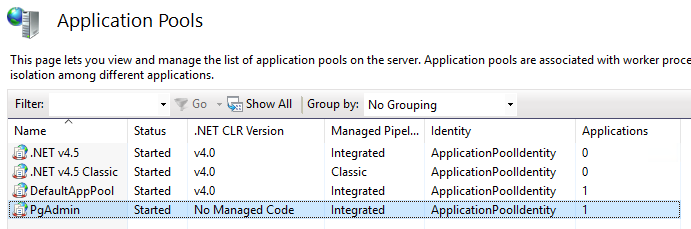
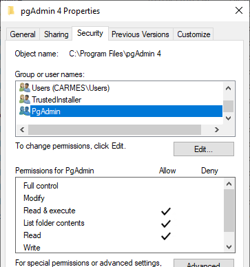

I just set out to create a PostgreSQL database server in my home lab, that I intend to use first with [Home Assistant](https://www.home-assistant.io/). And just because this is *my* home lab, it is hosted in a Windows Server 2019 VM in Hyper-V. 😁
I then foolishly installed pgAdmin 4 on my computer with the intention to remotely manage this new server... I remember pgAdmin III as such a slick application with an installer weighing less than 15MB. 4 years later the pgAdmin 4 installer is **10 times bigger**, a [Flask application](https://flask.palletsprojects.com/) that runs in the browser (these are the times we live in 🤷🏻‍♂️) once the server has started, which can take a while.

So I decided that this (otherwise fine) piece of bloatware belonged on a web server and not on my computer. This is not very difficult once you have got the recipe (and some experience on Windows of course).

## Ingredients
The ingredients are:
* a Windows Server machine. I used Windows Server 2019, but I am pretty sure the same applies to every version at least back to Windows Server 2008. Or Windows 8, for that matter.
* an instance of IIS. This can be [installed as a role inside Windows Server](https://docs.microsoft.com/en-us/iis/web-hosting/web-server-for-shared-hosting/installing-the-web-server-role) (or as as feature in Windows 10).
* [HttpPlatformHandler](https://www.iis.net/downloads/microsoft/httpplatformhandler) which is a IIS Module that can be used to manage any process on the server (we will be using Python in this case) and act as a reverse proxy.
* [pgAdmin 4](https://www.pgadmin.org/download/pgadmin-4-windows/):
  * it can be installed anywhere, but `%ProgramFiles%` is usually where programs go.

## Recipe

* [Create an application pool](#create-an-application-pool)
* [Create a website](#create-a-website)
* [Open the firewall](#open-the-firewall)
* [Configure the website](#configure-the-website)
* [Grant rights](#grant-rights)
* [Start the website](#start-the-website)

### Create an application pool
As a best practice you will need [a new Application Pool in IIS](https://docs.microsoft.com/en-us/iis/configuration/system.applicationhost/applicationpools/): this will allow us to isolate the application in a dedicated worker process with a dedicated identity. I named my pool *PgAdmin*:



### Create a website
Then we need a new website:
* select the Application Pool that we just created.
* create a new folder under `C:\inetpub` called `pgadmin`.
* configure your bindings as you wish: I configured my application to be accessible on port 3000. You will be able [to change this later if necessary](https://docs.microsoft.com/en-us/iis/configuration/system.applicationhost/sites/site/bindings/binding).
* do not start the website right away (there is still work to do).


### Open the firewall
Make sure your application is accessible by [opening the Windows Firewall if necessary](https://docs.microsoft.com/en-us/windows/security/threat-protection/windows-firewall/checklist-creating-inbound-firewall-rules) (on TCP port 300 in my case).

### Configure the website

Configure the website by adding the following configuration (cf. [Configure Python web apps for IIS](https://docs.microsoft.com/en-us/visualstudio/python/configure-web-apps-for-iis-windows)) in a file called `web.config` inside the `pgadmin` folder that you just created (you can use Notepad):
```xml
<?xml version="1.0" encoding="utf-8"?>
<configuration>
  <system.webServer>
    <handlers>
      <add name="PythonHandler" path="*" verb="*" modules="httpPlatformHandler" resourceType="Unspecified"/>
    </handlers>
    <httpPlatform
       processPath="%ProgramFiles%\pgAdmin 4\v5\python\python.exe"
       arguments="&quot;%ProgramFiles%\pgAdmin 4\v5\web\pgAdmin4.py&quot;"
       stdoutLogEnabled="true"
       stdoutLogFile="C:\inetpub\logs\pgadmin\pgAdmin4.log"
       startupTimeLimit="60"
       processesPerApplication="1">
      <environmentVariables>
        <environmentVariable name="PGADMIN_INT_PORT" value="%HTTP_PLATFORM_PORT%" />
        <environmentVariable name="PYTHONHOME" value="%ProgramFiles%\pgAdmin 4\v5\python" />
        <environmentVariable name="SERVER_MODE" value="True" />
      </environmentVariables>
    </httpPlatform>
    <modules>
      <remove name="WebDAVModule" />
    </modules>
  </system.webServer>
</configuration>
```
It is pretty straightforward but notably:
* the *arguments* attribute is quoted to account for the fact that the path contains spaces.
* the process outputs logs inside a folder called `C:\inetpub\logs\pgadmin` that would have to be created beforehand.
* pgAdmin notoriously [handles a single process only](https://www.pgadmin.org/docs/pgadmin4/development/server_deployment.html#requirements).
* *HttpPlatformHandler* will automatically create a process using Python and assign it a dedicated port using the `HTTP_PLATFORM_PORT` environment variable.

### Grant rights
And now we simply have to give the proper rights to our application pool user named `IIS APPPOOL\PgAdmin`:
* *Read & Execute* on the folder `%ProgramFiles%\pgAdmin 4` (and subfolders).
* *Read & Execute* on the folder `C:\inetpub\pgadmin`.
  * Create a subfolder called `pgAdmin` and give *Full Control* to the user. This where the application will store its data.
* *Full Control* on the logging folder (`C:\inetpub\logs\pgadmin` in my case).



### Start the website
Now you can start the website. Enjoy!

Note that the application will recycle automatically every 29 hours by default, which means that the next request will take much longer while the process is restarted. Not such a bad thing by itself, but obviously [this behaviour can be changed](https://docs.microsoft.com/en-us/iis/configuration/system.applicationhost/applicationpools/add/recycling/).

Also note that the logging folder should be cleaned up from time to time...

**UPDATE 2021-05-29:** the website configuration has been udpated for version 5 of pgAdmin... 4! Here is the configuration for version 4:
```xml
<?xml version="1.0" encoding="utf-8"?>
<configuration>
  <system.webServer>
    <handlers>
      <add name="PythonHandler" path="*" verb="*" modules="httpPlatformHandler" resourceType="Unspecified"/>
    </handlers>
    <httpPlatform
       processPath="%ProgramFiles%\pgAdmin 4\v4\runtime\python.exe"
       arguments="&quot;%ProgramFiles%\pgAdmin 4\v4\web\pgAdmin4.py&quot;"
       stdoutLogEnabled="true"
       stdoutLogFile="C:\inetpub\logs\pgadmin\pgAdmin4.log"
       startupTimeLimit="60"
       processesPerApplication="1">
      <environmentVariables>
        <environmentVariable name="PGADMIN_INT_PORT" value="%HTTP_PLATFORM_PORT%" />
        <environmentVariable name="PYTHONHOME" value="%ProgramFiles%\pgAdmin 4\v4\venv" />
        <environmentVariable name="SERVER_MODE" value="True" />
      </environmentVariables>
    </httpPlatform>
    <modules>
      <remove name="WebDAVModule" />
    </modules>
  </system.webServer>
</configuration>
```
