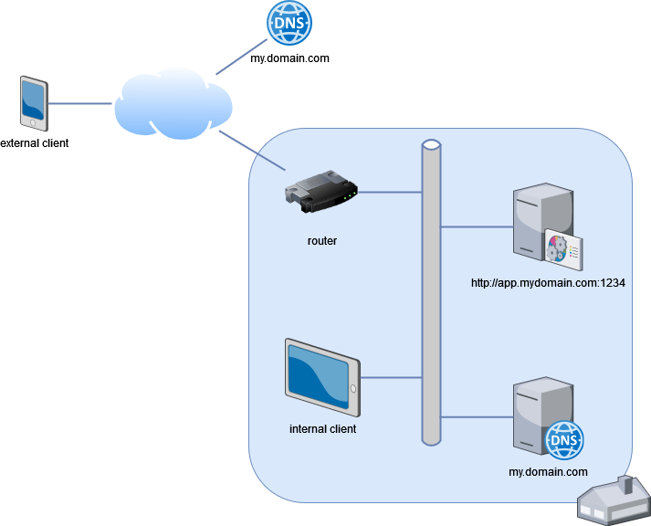
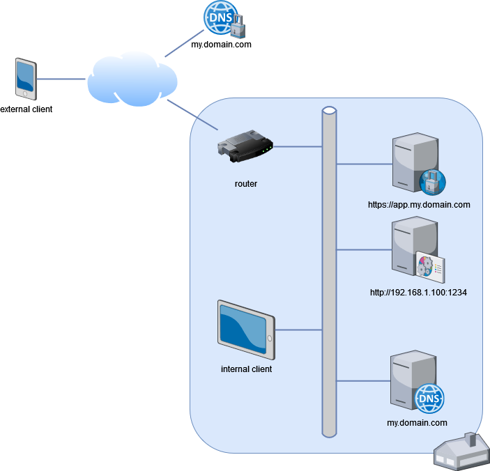

I love computers. I always have. And as a professional developer I always was a little bit jealous of my fellow systems administrators who were in charge of dozens of servers and desktops (and sometimes much more). Active Directory was a misterious world where seemed to lie an unreachable and absolute power. So of course, as soon a I could I set up a decent homelab for myself: DIY servers, NAS, 10Gb network, Hyper-V VMs, Active Directory... I also plunged into the wild world of domotics, starting [with Domoticz](https://www.domoticz.com/) and slowly migrating [to Home Assistant](https://www.home-assistant.io/).

Home automation applications have special DNS requirements, though, because an application that is installed on your phone must resolve to a different address whether you're at home in your private network or out in the wild. My internal needs are easily fulfilled by the DNS Server which is linked to my Active Directory. In parallel, I bought the same domain name on a DNS provider that redirects every request to my private router, which dispatches requests to the proper server according to the specific TCP/IP port of the application. Works alright enough.

But surely nowadays the least we require is an HTTPS connection, especially if we are going to send passwords over the Internet to applications that could entirely control our homes. And the management of TCP/IP ports become a tedious affair to manage when the number of applications grow. So the plan is first to set up a private Certificate Authority that can generate certificates for my applications: I should be the only one using those applications, so I can simply distribute my own root certificates to the devices that will use it (and Active Directory makes it very easy for Windows systems). One benefit over [Let's Encrypt](https://letsencrypt.org/) for instance is that it will avoid publicizing the names I use for my applications (cf. [Certificate Transparency](https://certificate.transparency.dev/)). A small Linux VM can easily be set up for this purpose only, that provides a [`step-ca` server](https://smallstep.com/docs/step-ca/). Easy peasy. Then I set up a reverse proxy application that can handle TLS negociations and requests forwarding based on the domain name of the request. Seems straightforward enough.

Except that it does not work. The reason being that modern browsers will use [DNS over HTTPS](https://en.wikipedia.org/wiki/DNS_over_HTTPS) (DoH) to resolve your addresses. At least it is my experience, though I could not find a definitive reference for this behaviour. So unless your private DNS server is able to handle DoH a public server that can will be used instead. As a result your internal clients will cease to be fed with your private adresses and will try to use the public adresses that are sent to them (which in that case should be the public address of your router). I learned this the hard way...

The solution here is to **set up DoH internally**, which my DNS Server is currently unable to handle. But I could set up another small Linux VM running [dns-dist](https://dnsdist.org/), that can handle DoH (with certificates generated by my private Certificate Authority) and then defer actual name resolution to my private DNS server. The new DNS server should then be used all over the private network. For good measure I also deployed this new DNS Server address to all my Windows clients using the [`Add-DnsClientDohServerAddress` cmdlet](https://learn.microsoft.com/en-us/powershell/module/dnsclient/add-dnsclientdohserveraddress) in an Active Directory startup script. As I understand it, it will then be automatically used by every system that is in the same IP subnet as the new private DNS Server. It will be picked up by the browsers as well, so now internal clients can properly resolve private addresses!

