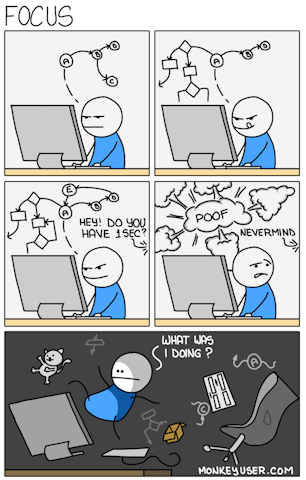
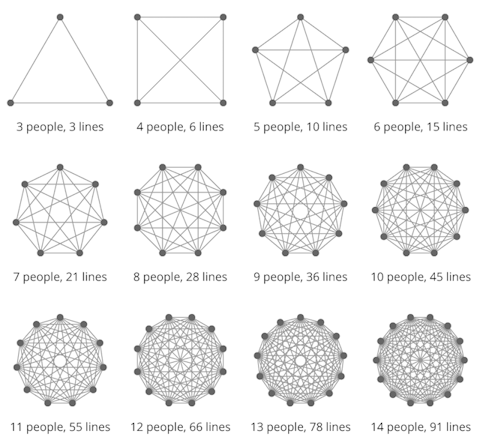
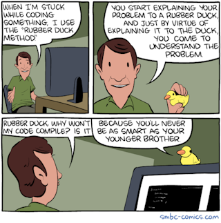
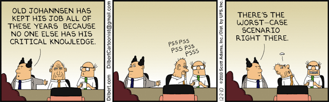

To me the main benefit of remote work (when done right) has always been the necessary focus on asynchronous communication. In these times when, [for some reason](https://thehill.com/opinion/technology/5775420-remote-first-productivity-growth/), remote gets a bad rap and [companies left and right](https://archieapp.co/blog/rto-companies-tracker/) implement new Return To Office (RTO) policies, the old synchronous ways seem to get a big revival. "People need to talk to each other", "it's just common sense". The idea is simple: put everyone together in an open-plan office and collaboration will naturally improve. Right?

Well, not quite, [according to overwhelming evidence](https://github.com/mcartoixa/open-offices-bookmarks). Asynchronous communication is more demanding and requires discipline. But it leads to better focus, better decisions, and better knowledge sharing, whether remote or in the office.

 * [Kill no flow](#kill-no-flow)
 * [Share knowledge, include everyone](#share-knowledge-include-everyone)
 * [Have deeper interactions](#have-deeper-interactions)
 * [Make history](#make-history)

## Kill no flow

Constant interruptions lead to [a higher workload, more stress, higher frustration, more time pressure, and effort](https://dl.acm.org/doi/10.1145/1357054.1357072). And they have [a strong negative impact on work quality](https://www.cogneurosociety.org/distractions_writing_foroughi/). It takes time and energy to get [into a state of flow](https://oxford-review.com/blog-how-to-get-into-flow-at-work/), and a very short interruption can ruin it all in an instant, requiring significant time to recover (also known as [Carlson](https://en.wikipedia.org/wiki/Sune_Carlson)'s law). Faced with only the threat of interruptions, many people will tackle easier, shorter tasks instead of delving into the most complex ones.

Asynchronous communication allows everyone to manage their most precious resource more effectively: time. You can check your messages when you are done with your current task: no-one expects you to answer immediately. In exchange for this mutual respect, everyone has to make sure they check their messages regularly. On their own terms.

## Share knowledge, include everyone

Synchronous communication is either very compartmentalized or very inefficient (and it can be both, of course). As teams grow, communication complexity increases dramatically (as described by [Metcalfe's law](https://en.wikipedia.org/wiki/Metcalfe%27s_law)). In practice, this leads to a trade-off: either exclude people from conversations, or rely on more frequent all-hands meetings.

Most synchronous discussions have to happen in a silo: improvised meetings at the coffee machine, or even in the open space (commonly known as _interruptions_). You will be de facto excluded if you happen to be in another meeting at that time, at home on a day off or just out for a 5-minute break. More meetings will be needed to keep everyone on the same page.

Asynchronous communication can easily solve all those problems. If you work in the open by default, in public spaces accessible by anyone, then the whole team can be included at all times, if only to gain the knowledge that there is something going on. Of course not everyone will follow every discussion that happen in the public square, but everyone will be able to make their own choices of what to follow or not. Even if you take some days off, you will have the opportunity to catch up with what happened while you were away.

## Have deeper interactions

Good async communication requires providing enough context upfront. The goal is to avoid unnecessary back-and-forth, since replies may not come immediately. As [Sahil Lavingia](https://sahillavingia.com/), founder at Gumroad, [wrote about async](https://x.com/shl/status/1222545251534925824):
> All communication is thoughtful. Because nothing is urgent (unless the site is down), comments are made after mindful processing and never in real-time. There's no drama.

One immediate benefit is [the rubberducking effect](https://en.wikipedia.org/wiki/Rubber_duck_debugging): while it may cost me more time to write a comprehensible question than to interrupt the coworkers that happen to be next to me right now, in many cases I may not even need to send the message. The mere fact of synthesizing a proper context for my message can provide me with the clarity I need to answer my own question.

More importantly, effective interruptions would require that all participants were able to mobilize all their knowledge on the spot, on demand, unprepared. This is obviously rarely the case, and improvised discussions very often lead to some variation of "I'm not sure" or "Let me check". Asynchronous communication avoids all of this: I can take the time to come back with a comprehensive answer everytime.

## Make history

Writing things down is [what turns activity into history](https://en.wikipedia.org/wiki/Recorded_history#Prehistory), and history into organizational learning. When communication is written and preserved, your organization gains the ability to learn from its past.

In many synchronous companies, most of the organizational knowledge lives in the heads of a few senior employees that happened to be present when decisions were made (aka [tribal knowledge](https://en.wikipedia.org/wiki/Tribal_knowledge)). But the older the knowledge, the more fuzzy it gets: it is just human nature.

Some companies may have the discipline to commit their discussions to writing, but this is always done after the facts, and usually in a hurry (think of meeting notes for instance). People can refer to those documents when they want to understand the context that led to a specific decision, which will be the first time most of them are thoroughly read and they will only find them obtuse and difficult to understand, often by lack of context.

Asynchronous communication relies on written communication that is meant to be read every time (please do not do voice messages 🙃), and ambiguities rarely make it to the final documents.

Async is not just a remote work practice, it is a better default for modern knowledge work. It requires effort and discipline, but the payoff is a calmer, more thoughtful, and an overall more effective way to collaborate.
