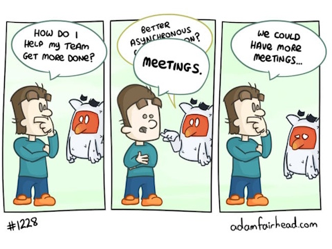
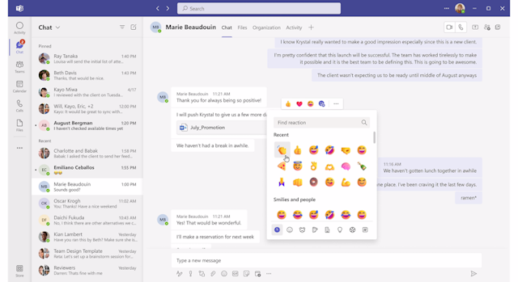
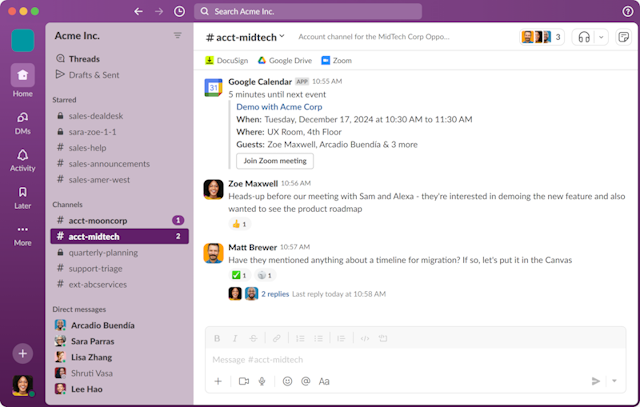

At the core of asynchronous communication is a _messaging system_ that allows teams to communicate (and work) continuously [in public](/blog/software-craftsmanship/2026/03/31/the-benefits-of-asynchronous-communication.html#share-knowledge-include-everyone). The necessary features for an effective messaging tool are:
 * channel based communication, to gather discussions by team, project or interest. Just be careful to make the channels broad enough to avoid creating new silos.
 * threaded discussions, so that notifications are only delivered to the people who showed interest in a particular subject.
 * external tools integration (and messaging), to give more visibility on the work being done outside of the _messaging system_. It is also a way to unify the communication and the notification systems.

[Slack](https://slack.com/) was the precursor in this field and is the obvious choice. [Microsoft Teams](https://www.microsoft.com/en-us/microsoft-teams/group-chat-software) is still an inferior choice IMHO but it can still get the job done, and I heard some companies used [Discord](https://discord.com/) successfully in this context. But as per usual, the tool itself is less important than the way we use it as a team.

Over the years, I have found a handful of rules that have helped our teams get the most out of asynchronous communication. None of them are absolute (YMMV), and every team can adapt them differently, but they have served me well over the years:
 * [General principles](#general-principles)
 * [Chat based communication](#chat-based-communication)
 * [Channel based communication](#channel-based-communication)
   * [Microsoft Teams specific rules](#microsoft-teams-specific-rules)

## General principles

 * The _messaging system_ is essentially an asynchronous communication tool (except for meetings of course 😅).
   * A message **never** expects an immediate response or reaction.
   * You can disable your notifications and focus on your work.
 * Take some time multiple times a day to communicate and check on active discussions. Asynchronous means the team is giving you time to react on your own terms, but it does not mean others should have to wait for days for a reply.
 * In case of an emergency (if production goes down for example), it will always be beneficial to share the information with as many people as possible on the _messaging system_, but dedicated urgent communication methods must still be activated to alert the individuals concerned by the emergency.
 * Do not wait for a meeting to share a question, a suggestion or even a simple thought:
   * communication should be asynchronous **and** continuous. Share your information now and do not risk forgetting to share it later.
   * if no one seems interested in what you have to say, then no big deal. 😉
   * if you feel like introducing all your messages with “Hello” or “Hi”, it means that you are probably not communicating continuously enough.
 * Be considerate and provide context: do not assume everyone knows what you are talking about. Take time to provide links for people who want to know more about what you are writing about.
 * No FOMO: if the _messaging system_ is used properly, it will be impossible for everyone to follow all discussions.
   * Every piece of information you receive this way is valuable.
   * Every piece missed would have probably been missed as well in a synchronous organization because it would have happened in another silo (ie a meeting, planned or improvised, you were not part of).
 * Always try to initiate an exchange asynchronously first (_async first_). If written communication fails (if it is too difficult to understand each other, for instance), then a synchronous exchange with the stakeholders can be scheduled.
 * Following a synchronous coordination, do not forget to report the conclusion of the exchanges in writing so that everyone can follow up on the matter (_async last_).

## Chat based communication

_Chats_ are by nature communication silos which are only accessible to people who have been invited. Except in rare cases where confidentiality is imperative, every discussion, including those between two people, should take place in a public _channel_ instead of a _chat_.

In any case, Just remember that _chats_ are asynchronous as well.

## Channel based communication

 * _Channels_ can be created to allow specialized discussions by project, team, or theme. To maximize visibility it is better to start by discussing openly in an existing _channel_ and then decide to redirect an overflow of information to a new dedicated one.
 * Automated bot notifications (JIRA notifications, for example) should not be mixed with human discussions in the same _channel_.
 * Everyone is free to subscribe or not to notifications from a _channel_. But it will obviously be more difficult to communicate effectively if everyone does not subscribe at least to the topics that concern them directly.
 * When creating a new _channel_, it should be promoted in the main _channel_ so that everyone has the chance to subscribe.
 * Let people decide what they care about: it is better to broadcast information that interests few people in a general _channel_ than to risk broadcasting important information in a hidden _channel_ that only a few people have subscribed to.
 * Avoid systematically mentioning people you want to specifically address in a discussion:
   * subscribers to the _channel_ will receive a notification of a new message anyway.
   * people already participating in a discussion (reply or reaction) will also receive a notification.
   * one of the benefits of open discussion is the passive ability to include people who might unexpectedly have useful insights to contribute.
 * Mentioning allows attracting the attention of a specific person who may not be subscribed to the _channel_ (who is outside the team, for example), or to send a (kind) reminder to someone from whom a response is expected.
 * Always answer in _thread_.
 * Keep _threads_ focused. Side discussions should be quickly promoted to their own _thread_.
 * Don't keep _threads_ active for too long. Long-running discussions tend to become difficult to follow, and starting a fresh _thread_ can provide a useful reset and summary point. It also shows all the observers the subject is still being discussed.

### Microsoft Teams specific rules
Teams requires a few additional conventions because its _channel_ model differs from Slack:
 * _Channels_ are a way to organize discussions within a _team_. The notion of _team_ should be considered very broadly to avoid communication silos.
 * Within a _team_, all _channel_s must allow [threaded display mode](https://adoption.microsoft.com/fr-fr/microsoft-teams/new-chat-and-channels-experience/threads-in-channels/). This limits notifications to those who are interested in the discussion (those who reacted or replied).
 * Within a _team_, there is always a general discussion _channel_ that interests (at least) the entire
_team_.
 * It is possible to [mark a message as important](https://support.microsoft.com/en-US/teams/chat/mark-a-message-as-important-in-microsoft-teams) in a _channel_. Use this feature sparingly and with discernment: if everything is important, nothing really is.
 * _Channels_ are also [a way to share resources](https://learn.microsoft.com/en-us/microsoftteams/teams-channels-overview) (documents, files…) accessible to an entire team, present and future.

None of these rules are revolutionary. Their purpose is simply to make communication visible, searchable, and respectful of everyone's attention. The exact tools may change, but the underlying principles remain the same: communicate in the open, write things down, and give people the freedom to respond on their own terms.
