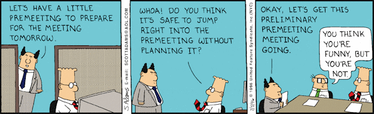
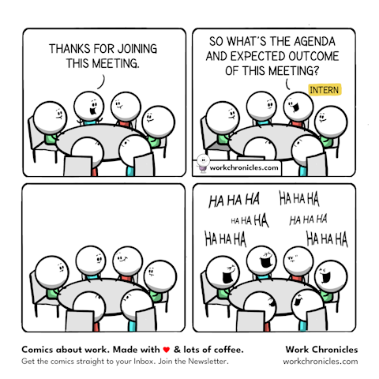

[Meetings are interruptions](/blog/software-craftsmanship/2026/03/31/the-benefits-of-asynchronous-communication.html#kill-no-flow), but they are sometimes necessary.

For the purpose of this article, I will distinguish three broad types of meetings:
* [information meetings](#information-meetings). Even if you have a very effective communication culture, it is still necessary to regularly make sure that everyone has the same level of information and is aligned with the rest of the group.
* [decision meetings](#decision-meetings). Good decisions should be based on good information, so they are often an extension of information meetings.
* [collaboration meetings](#collaboration-meetings). Think brainstorming, retrospective or pair (or even mob) programming.

Whatever their type, what efficient meetings have in common is preparation: there should be a plan, and objectives should be clear for every attendee before the meeting even starts. You know a pair programming session will lead to a lot of wasted time if the first question is "What should we do today?". Preparation is key, and obviously asynchronous. Unless you want to organize a meeting to prepare your meeting, of course...

## Information meetings

Information meetings have the most to gain from a good asynchronous preparation. If the goal is alignment, then all the information should already be available in [your asynchronous messaging system](/blog/software-craftsmanship/2026/06/26/using-an-asynchronous-messaging-system.html).

You should thus be able to write a thorough brief collaboratively beforehand (including the agenda), which will naturally become the meeting notes as part of the process I am describing. Set up a policy that everyone involved in the meeting should gather and summarize the information in advance (say half a day), in your collaborative document editor of choice: _Google Docs_, _Microsoft Word_, _Notion_... Everyone should expect that the first draft of the document will be available at a predetermined and fixed time before the meeting, ready to be read and commented on. A few guidelines here:
* The document should be a concise (but thorough) and coherent summary and should be understandable on its own, even if only at a basic level. People coming back from a two-week vacation should be able to understand the document just by reading it.
* Don't be shy about providing plenty of links for people who want to know more: _Slack_, _Teams_, _Jira_, _YouTrack_...
* AI tools can help produce the first draft: just make sure that the result is readable and comprehensible by your fellow meeting attendees. AI slop is difficult to read, so take care of your readers.

Once the document is ready, everyone should take the time to read it and add comments. Writing for other people is hard and what is obvious to you may not be so obvious to other people. The majority of comments should usually be about a clarification of some sort. When the comments come (and they will), don't clarify the meaning by answering them: amend the document directly and ask if the changes make the intent clearer. If so, the comments can be resolved.
* You know the meeting notes are ready when there are no comments left to resolve.
* If a comment remains unresolved, or starts a long back-and-forth, it may point to a topic that needs focused discussion. You then know that you should focus your collective attention there during the meeting itself. Make it clear in the document, show all sides of the argument and close the comments.

This kind of preparation shares a lot with (and was actually inspired by) [silent meetings](https://medium.com/swlh/the-silent-meeting-manifesto-v1-189e9e3487eb). One advantage they share is that you can be sure that the meeting notes are readable, as they have actually already been read by many people. I have stumbled on too many unusable meeting notes that had been written too hastily during the meeting itself and lacked the context to be of any use. The main difference from silent meetings is that preparation happens in everyone's own time. Another advantage is that you can often skip the meeting entirely if you manage to resolve all comments asynchronously.

One drawback is that this only works in organizations where people can trust each other to spend some time in advance to save other people's time. This should already be the case if you are part of an asynchronous organization. But if not, silent meetings are still your best option.

## Decision meetings

Good decisions require good information, so you can follow the same pattern: ask the attendees to gather, in a shared document, the information that will allow the group to make the best informed decision. Options, pros and cons can all be discussed asynchronously. In some cases the decision will even become obvious before the meeting takes place. Have the first back-and-forth in the comments, understand where the sticking points are and focus your time on them during the meeting.

Once the decision is made, write it down in the same document, along with the reasoning behind it. People who were not in the room will understand not only what was decided, but why. And so will the actual attendees, six months down the road. Your organization now [has a history](/blog/software-craftsmanship/2026/03/31/the-benefits-of-asynchronous-communication.html#make-history).

## Collaboration meetings

Collaboration meetings are obviously a different beast: they **do** have to happen at some point. But you can still shave off a lot of unproductive time by preparing them asynchronously. Make sure you gather all the context you need, [trust Ike](https://quoteinvestigator.com/2017/11/18/planning/) and make a plan:

> Plans are useless, but planning is indispensable.

In practice, this could look like the following:
* Retrospectives: ask everyone to add their items to the board beforehand. The meeting can then start with grouping and discussing instead of 15 minutes of silent sticky-note writing.
* Brainstorming: share the problem statement and its constraints in advance, and let people post their first ideas asynchronously. The meeting can then be spent building on and challenging those ideas, rather than waiting for them to come.
* Pair programming: agree in writing on the goal of the session, with links to the relevant ticket and code. That way it can start at the keyboard, and not with some soul-searching.

---

From experience, a big chunk of unproductive time comes from information (and decision) meetings: there are too many of them, they are barely prepared and nothing comes out of them. Asynchronous communication easily solves the first problem by tearing down silos (less need for constant realignment should mean fewer meetings), and the technique described above goes a long way toward improving their efficiency. I experienced it firsthand in an organization that went fully remote almost overnight (thanks, COVID!). And now you can experience it too.
